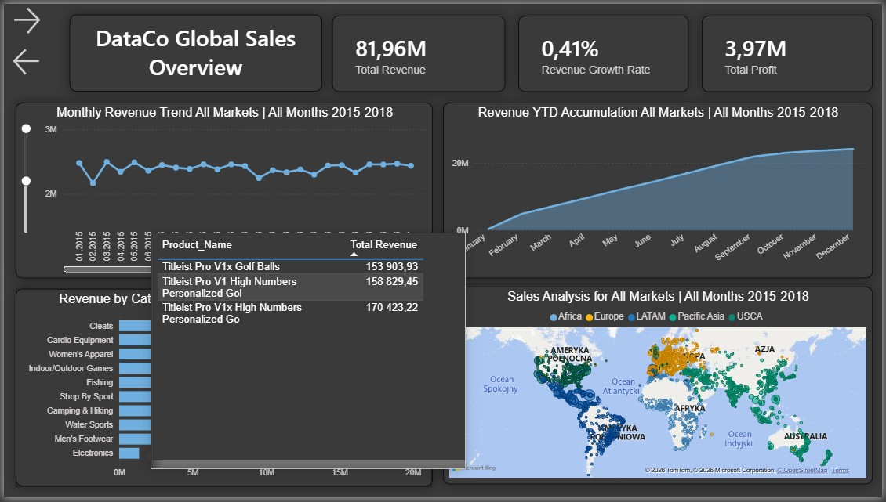
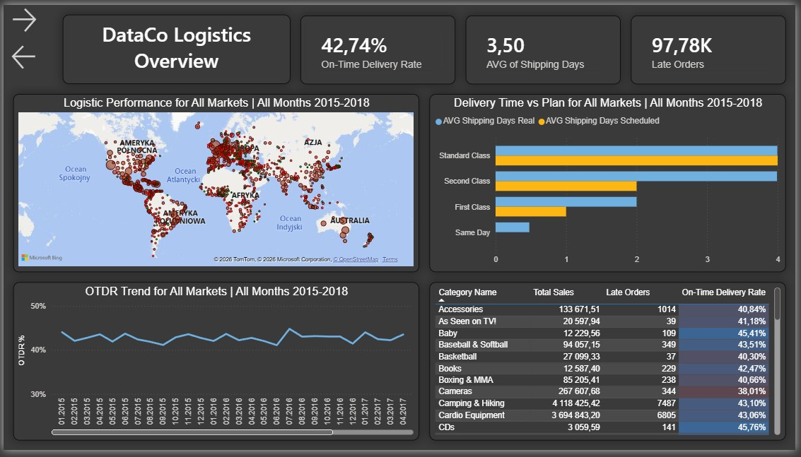
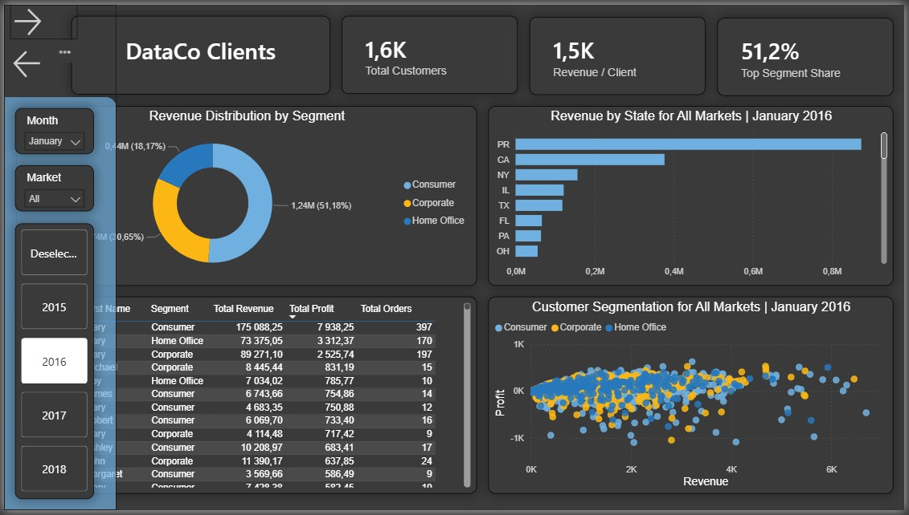
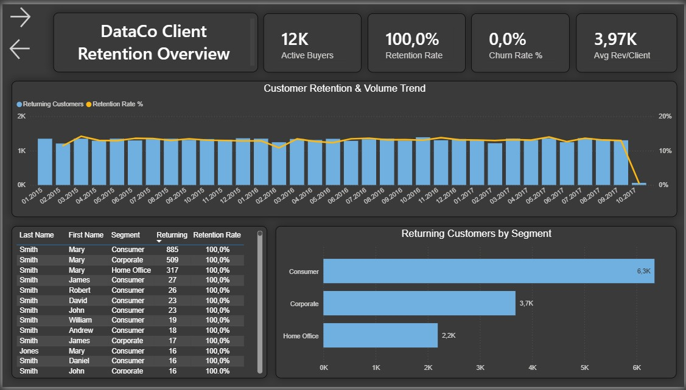

# DataCo Supply Chain Analytics

## 1. Project Objective
Preparing the DataCo Supply Chain dataset for business analysis. The project covers the full ETL process – from data cleaning and modeling in SQL to visualizing key performance indicators (KPIs) in Power BI.

## 2. Technologies
* SQL Server / T-SQL (cleaning, transformation, modeling)
* Power BI (visualization, DAX)

## 3. Data Architecture
Star Schema: fact table (Fact_Sales) and four dimension tables (Dim_Customer, Dim_Order, Dim_Product, Dim_Date).

## 4. ETL Stages
* **Quality Verification:** Auditing the `stg_DataCoSupplyChainDataset` table using `SUM(CASE WHEN...)` and `TRY_CAST` to identify missing values and formatting errors.
* **Data Cleaning:** Preparing staging tables, unifying data types (financials), and deduplicating records.
* **Data Modeling:** Transforming the flat structure into a star schema (Fact_Sales and dimensions).
* **Testing:** Verifying model integrity through relationship tests (`LEFT JOIN` to detect orphan records).

## 5. Roadmap
* **Power BI:** Data import and relational model configuration.
* **DAX:** Implementation of measures (e.g., YoY Profit Margin, delay metrics).
* **Dashboard:** Building a report for the logistics department.
* **Deployment:** Presenting business insights.

## 6. Power BI Report Implementation
The report was designed for business and operational users, combining aesthetics (Dark Mode) with measure performance optimization.

### Page 1: Global Sales Overview
* **KPI Monitoring:** Analyzing total revenue, sales dynamics, and profits from a global perspective.
* **UI/UX:** Implementing a slide-out filter panel (Slicer Pane) to save workspace.
* **Details on Demand:** Using custom Tooltips to display the Top 3 products by revenue when hovering over a category.
  

### Page 2: Logistics Overview
* **Operational Efficiency:** Monitoring the OTDR (On-Time Delivery Rate) and identifying shipping delays.
* **Bottleneck Analysis:** Comparing actual vs. planned shipping time split by shipping classes.
* **Dynamic Context:** Implementing DAX measures that automatically update chart titles based on selected markets and timeframes.

### Page 3: Clients Analytics
* **Revenue Structure:** Analyzing the structure of the customer base (18.5K clients) split by segments (Consumer, Corporate, Home Office), where the consumer segment generates nearly 52% of total revenue.
* **Geography & Rankings:** Identifying key markets through geographical revenue analysis (Revenue by State) combined with a top customers ranking table.
* **Segmentation (Scatter Plot):** A scatter plot mapping Profit against Revenue per customer, allowing quick isolation of high-margin and loss-making transactions.
  

  ### Page 4: Customer Retention
* **Customer Loyalty:** A dedicated cohort and trend module monitoring the number of returning buyers (Returning Customers) and the stability of the Retention Rate over time.
* **Churn Analysis:** Analyzing churn rate trends by market segments, crucial for optimizing B2B and B2C marketing and retention activities.
  

### DAX Analytics:
* Utilizing Time Intelligence functions to calculate cumulative values (Revenue YTD) and Year-over-Year growth indicators (Revenue Growth Rate).
* Applying iterative functions (`CONCATENATEX`) combined with filter context verification (`ISFILTERED`) to automate the descriptive layer of the report.

  ---
*Autor: Anna Wiatrowska*
